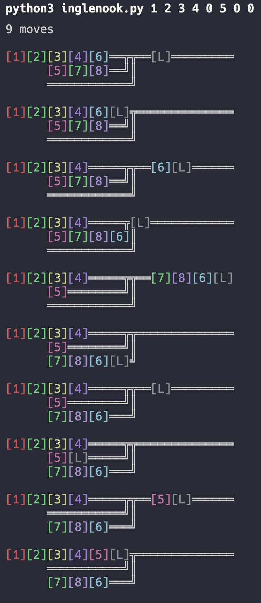

# Shunting puzzles

## Inglenook

There are 8 cars among 3 tracks.

The goal is to arrange the cars 1 2 3 4 5 in order, and the 0 cars are ones we don't care about.

The limitations:
* The first 5 cars start on the first track, which can hold a maximum of 5 cars
* The next 3 cars start on the second track, which can hold a maximum of 3 cars
* The third track starts empty and can hold a maximum of 3 cars
* There is also a shared shunting area that can hold a maximum of 3 cars (plus the locomotive)

A valid move is for the locomotive to push or pull attached cars into or out of the shunting area, and can move 3 cars at a time (attaching and detaching is free).

A track can hold more cars than its maximum WHILE the locomotive is present.

Random arrangement:
```python
python3 inglenook.py
```

Specified arrangement:
```python
python3 inglenook.py 1 2 3 0 4 0 5 0
```

[Inglenook rules](http://www.wymann.info/ShuntingPuzzles/Inglenook/inglenook-rules.html)

### Inglenook example:


